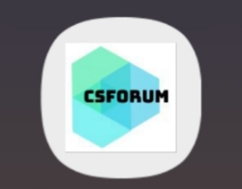
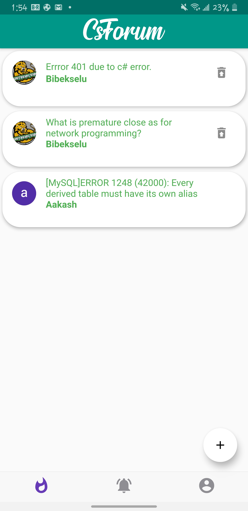
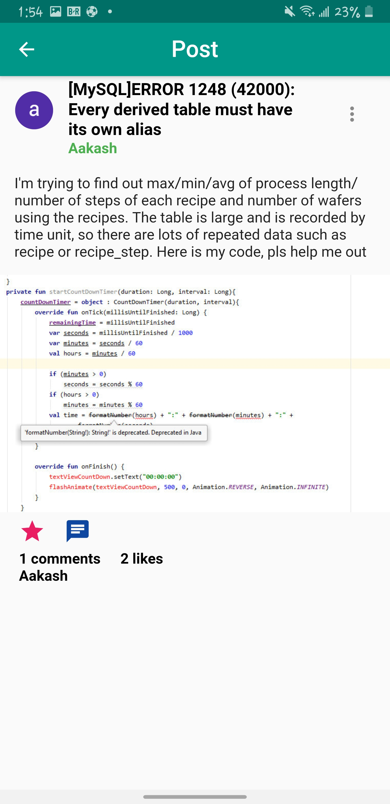
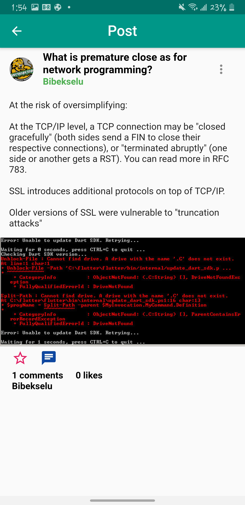
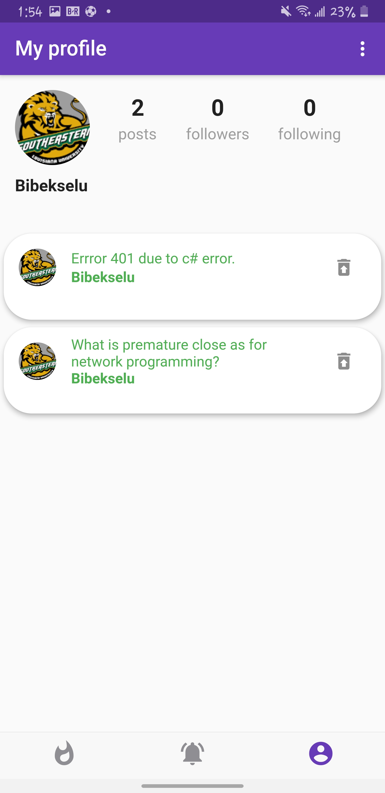
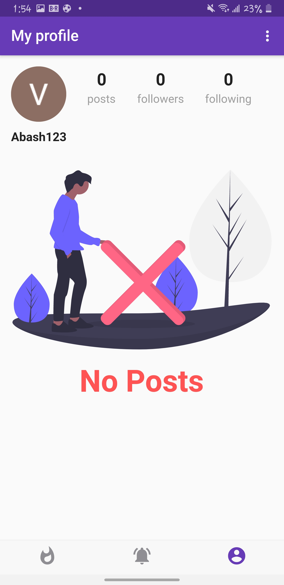
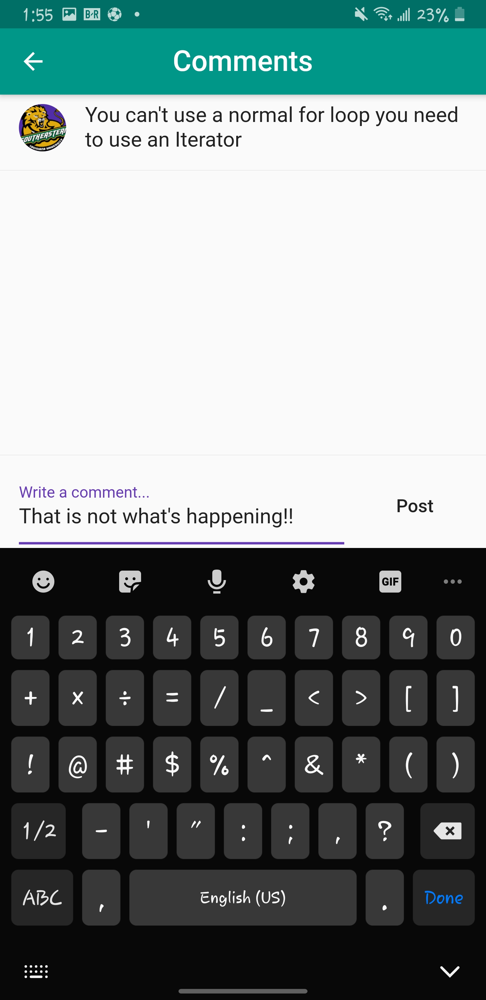
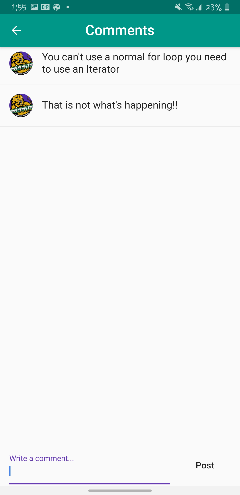
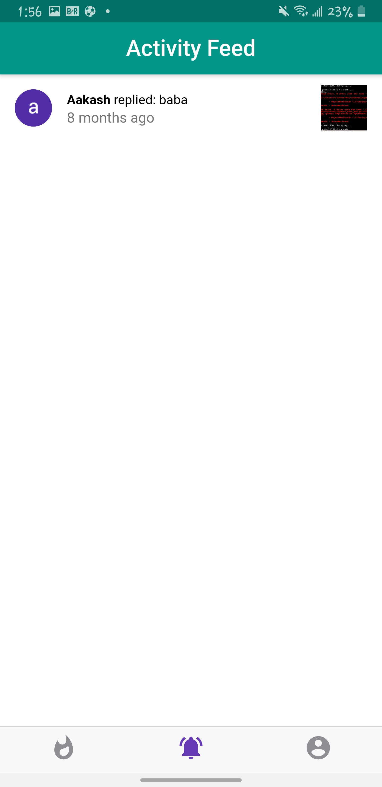

# About App

This App was meant to made available for those who wants to share their trouble while doing the programming problem or the problem related to web development.\
There is a lot of app like that but this app was meant for the college students so that they doesnt have to go to online ,post the problem and wait for reply. \
They can get answer about respective question from their collegemates or the alumni.

# Technology Used

Language:Dart \
Framework:Flutter \
Database:Firebase

# Logo
 

# AppImages
  

   

  
  

